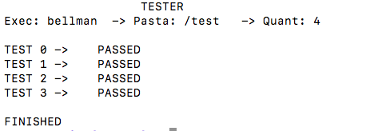

# TestesAutomatizados
Simples programa de teste que realiza comparação automática dos arquivos de entrada e saída do seu programa.

## Sobre o Tester
O Tester é um programa desenvolvido em C++ que automatiza a comparação entre os arquivos de entrada do seu sistema com as saídas esperadas. Ótimo para automatizar testes para sistemas simples.



## Instalação
Você pode copiar o código fonte para a pasta do seu projeto e compilá-lo com o seguinte comando:
```
  g++ tester.cpp -o tester 
```
É necessário o pacote diff e um compilador para c++ (g++ ou clang) previamente instalado.

## Execução

Com o executável na pasta do projeto você pode executar o comando:

```
  ./tester --help
```

E verá os detalhes do sistema.

Você pode organizar seus arquivos de teste em uma única pasta, e os mesmos devem ser nomeados da seguinte maneira:

- ./testes
  - ~ 0.in
  - ~ 0.sol
  - ~ 1.in
  - ~ 1.sol

Sendo os arquivos de entrada finalizados com .in e os de resposta com .sol, todos enumerados em sequência conforme exemplo.

Tendo isso, já podemos trabalhar com o Tester, executando-o da seguinte maneira:
```
    ./tester exec pasta n d
```
  - exec  -> Arquivo executável.
  - pasta -> Nome do diretório de testes.
  - n     -> Número de arquivos de teste.
  - d     -> Caso passado, ele removerá os arquivos .res de saída do programa usados para comparacão.
  
O Tester apresenta como saída os seguintes status:
  
  - PASSED -> Seu programa executou corretamente e exibiu a saída esperada.
  - EXECUTION ERROR -> Seu programa teve um erro de execução com a entrada ( podem aparecer erros exibidos pelo sistema relacionados ao problema.
  - NOT IDENTICAL -> Seu programa executou corretamente mas exibiu uma saida diferente a esperada.
